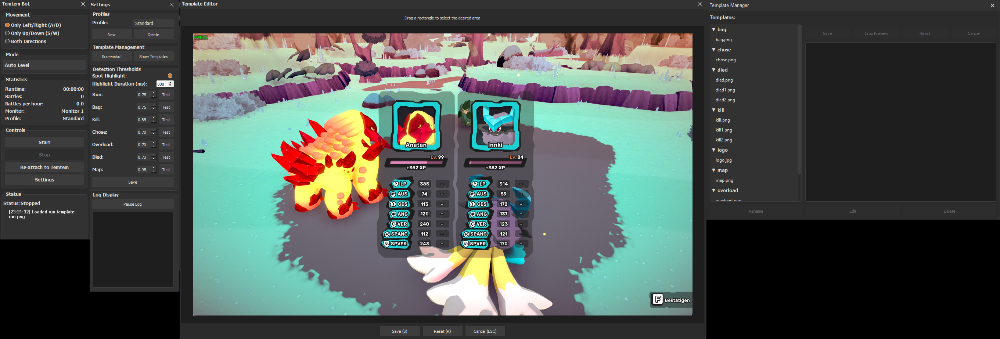

# Temtem Auto-Leveling Bot

A bot for automated leveling in Temtem, featuring a modern GUI and profile system.



## Important Notes

> **Game Settings**  
> The template images in the `img` folder are configured for these specific game settings:
> - Window Resolution: 1360x768
> - Quality: Low
> - Texture: Low
> - UI Scale: 100%

> **Language Settings**  
> Some template images contain German text. If you use Temtem in a different language, you'll need to create new templates for:
> - Kill button ("kill")
> - Choice dialog ("choose")
> - Overload dialog ("overload")
> - Death screen ("death")
>
> Other templates (like Battle UI buttons) use universal symbols and don't need to be changed.

> **Window Handling**  
> - The bot briefly activates Temtem only when sending inputs
> - Returns focus to your previous window automatically
> - Inputs are exclusively sent to Temtem
> - Allows you to use your PC while botting
> - Full support for multi-monitor setups

> **Note**  
> The `config.json` file is created automatically. If the Temtem game client is not running when trying to attach, you'll need to specify the Temtem executable path. This allows you to start Temtem directly through the bot if desired.

> **Contributing**  
> Feel free to make commits and make the bot better!

## Features

- **Auto-Leveling**: Automatically handles battles and movement for efficient leveling
- **Modern GUI**: Clean, dark-themed interface with real-time statistics
- **Battle Detection**: Advanced image recognition for battle state detection
- **Smart Window Focus**: 
  - Briefly activates Temtem only when sending inputs
  - Returns focus to your previous window automatically
  - Inputs are exclusively sent to Temtem
  - Allows you to use your PC while botting
- **Multi-Monitor Support**: Full support for multi-monitor setups
- **Configurable Movement**: Choose between horizontal (A/D), vertical (S/W), or both movement patterns
- **Customizable Settings**: 
  - Multiple configuration profiles
  - Automatic loading of last used profile
  - Persistent settings across sessions
  - Adjustable thresholds for each template type
  - Live testing of recognition settings
  - Visual feedback for threshold testing
  - Save and load different configurations
- **Template Management**: 
  - Built-in template manager for maintaining recognition patterns
  - Create new templates with integrated screenshot tool
  - Edit, rename, delete, and adjust existing templates
  - Visual template preview and testing
  - Real-time threshold adjustment
- **Real-time Monitoring**: Visual feedback with green circle highlighting for detected elements

### TODO
- **Input Methods**: Currently using safe window focus for inputs. Optional background methods could be implemented but would risk detection
- **Additional Languages**: Add more template sets for different game languages
- **Auto-Update**: Implement automatic updates for template images when game UI changes

## Requirements

- Windows 10/11
- Python 3.8 or higher
- Temtem game client

## Installation

1. Clone the repository:
```bash
git clone https://github.com/yourusername/temtem-bot.git
cd temtem-bot
```

2. Install required packages:
```bash
pip install -r requirements.txt
```

## Usage

1. Start the bot:
```bash
python autolevel_gui.py
```
Or use the provided batch file:
```bash
start_temtem_bot.bat
```

2. The bot will try to automatically attach to the Temtem window
3. Configure movement pattern (A/D, S/W, or both)
4. Click "Start" to begin auto-leveling

## Configuration

### Settings Window
- **Profiles**: 
  - Create, edit, and delete configuration profiles
  - Each profile stores its own thresholds and settings
  - Quick profile switching without restart
  - Export/Import profile configurations
  - Automatic loading of last active profile
  - All settings (thresholds, movement mode, visual feedback) are saved per profile

- **Recognition Settings**:
  - Individual thresholds for each template type:
    - Map detection (default: 0.95)
    - Battle UI (default: 0.75)
    - Kill button (default: 0.85)
    - Chose dialog (default: 0.70)
    - Overload dialog (default: 0.70)
    - Death screen (default: 0.73)
  - Test buttons for each threshold
  - Visual feedback during testing
  - Real-time threshold adjustment

- **Visual Feedback**:
  - Enable/disable green circle highlighting
  - Adjust highlight duration
  - Test highlight visibility

### Config File
The `config.json` file stores:
- Active profile selection
- Profile-specific settings
- Recognition thresholds
- Visual feedback preferences
- Movement mode preferences
- Temtem executable path

## Files

- `autolevel_gui.py`: Main GUI application
- `autolevel.py`: Core bot functionality
- `template_manager.py`: Template management system
- `settings_gui.py`: Settings interface
- `config.json`: Configuration file
- `img/`: Directory containing recognition templates

## Dependencies

```
pyautogui==0.9.54
pywin32==306
Pillow==10.2.0
numpy==1.26.4
opencv-python==4.9.0.80
mss==9.0.1
PyQt5==5.15.10
send2trash==1.8.0
```

## Contributing

1. Fork the repository
2. Create your feature branch (`git checkout -b feature/AmazingFeature`)
3. Commit your changes (`git commit -m 'Add some AmazingFeature'`)
4. Push to the branch (`git push origin feature/AmazingFeature`)
5. Open a Pull Request

## Disclaimer

This bot is for educational purposes only. Use at your own risk and responsibility. Make sure to comply with Temtem's terms of service and user agreement.

## License

This project is licensed under the MIT License - see the [LICENSE](LICENSE) file for details. 